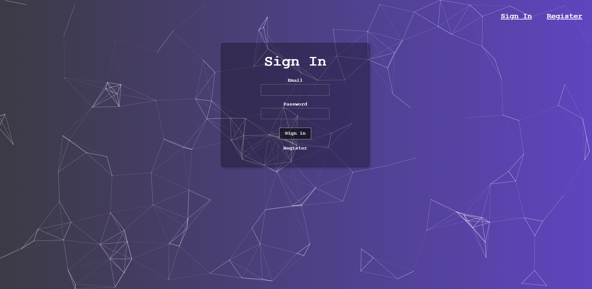
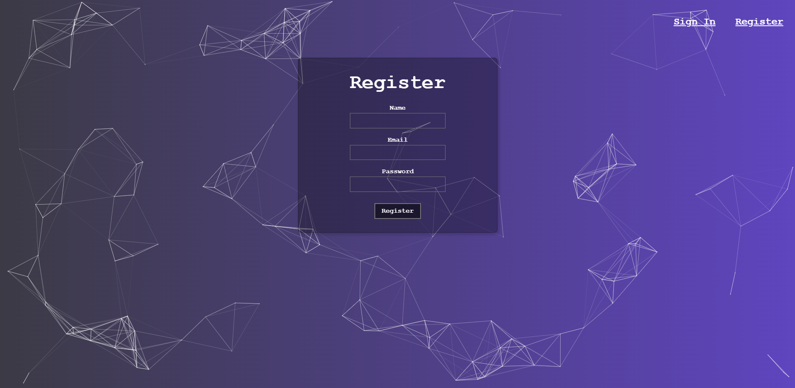
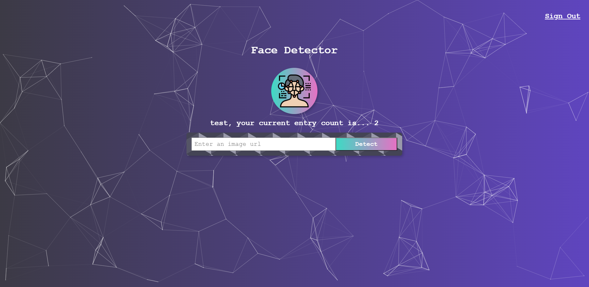
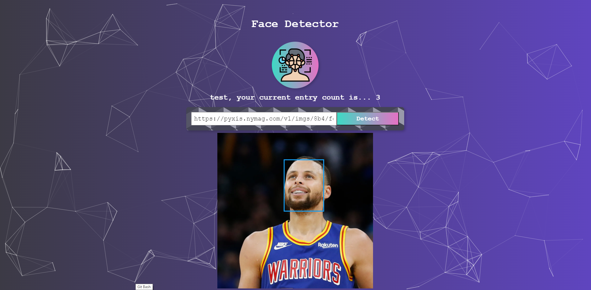

# Face Detector
This application detects and labels faces in user inputted images. Users can register and login to track how many images they submitted.

- URL: https://face-detector-12.herokuapp.com/
- NOTE: The application may take a while to load as it is hosted on Heroku free tier.

## Table of Contents
1. [Implementation Detail](#implementation)
    1. [Frontend](#frontend)
        1. [Planning the User Interface](#planningui)
        2. [Building a Static Version](#buildingstatic)
        3. [Adding State](#addingstate)
        4. [Adding Inverse Data Flow](#inverseflow)
    2. [Backend](#backend)
        1. [Making an Express Server](#express)
        2. [Creating a PostgreSQL Database](#database)
        3. [Putting the Pieces Together](#puttingtogether)
    3. [Deploying the Web App](#deployingwebapp)
2. [Using the Application](#usingtheapp)
3. [Built With](#builtwith)

## Implementation Detail <a name="implementation"></a>
There are 2 main parts of the application; a frontend UI built with React and a backend API built in Node.js.

### Frontend <a name="frontend"></a>
I started the project on the frontend side, first focusing on the intended layout of the website. Afterwards, I added functionality to the buttons. Lastly, I added conditional rendering based on user login status.

#### Planning the User Interface <a name="planningui"></a>
I planned out the layout of the application by breaking it down into a component hierarchy. Going over the UI, there were four main sections I had in mind. The parent App component would be composed of all the main sections, and each section would have additional, smaller components if necessary.
1) A navigation bar along the top
2) A heading area with a title, logo, and any additional text
3) An input element coupled with a button for users to enter image links
4) The area for the image to be displayed along with a bounding box around any faces

#### Building a Static Version <a name="buildingstatic"></a>
Next, I built out a static version of the UI without any functionality. I broke down the interface into smaller components and built each one step by step from top to bottom. At this point, state was not yet implemented. After I was satisfied with the page layout, I moved on to adding state and functionality to the buttons. 

#### Adding State <a name="addingstate"></a>
Looking back at the main sections of the application, there were a couple pieces that required state.
1) The text displaying how many images a user inputted
2) The input box for image urls
3) The area for the image to be displayed along with a bounding box
Essentially, everything that would have to change overtime was considered to be state.

React is all about uni-directional data flow down the component hierarchy, so deciding where the state should reside was important. As the main part of the application is relatively simple, existing on a single page, it made the most sense to put all the state in common owner component which was the main App component.

#### Adding Inverse Data Flow <a name="inverseflow"></a>
In addition to flowing down the component hierarchy, data needed a way to flow back up from the children to the parent. Thus, I passed down callbacks from the parent App component to each of the stateful children components, along with onChange handlers. This way, when the child components were updated, the callback functions would be fired in the parent component, thereby updating the state accordingly.

### Backend <a name="backend"></a>
The second part of the project was the backend API to handle user login as well as fetching data from third-party APIs.

#### Making an Express Server <a name="express"></a>
I started the backend by planning out the necessary API endpoints.
|Endpoint | Request Type | Description |
|-------- | ------------ | ----------- |
|/signin | POST | Validate user login credentials; return an error if invalid and return the user information if valid. |
|/register | POST | Given valid registration details, add a new user to the database. |
|/profile/:id | GET | Return a given user's information. |
|/image | PUT | Update a user's image submission count. |
|/imageurl | POST | Given a user inputted image url, fetch the face detection details from Clarifai API. |

In order to test the endpoints, I created a mock database by using JSON objects in my server file. This way, I could make sure my server actually worked before connecting it to a real database. After I tested my endpoints with Postman, I needed a way to actually store data. This leads to the next section on creating a database.

#### Creating a PostgreSQL Database <a name="database"></a>
I first had to decide what database I wanted to use. I opted for PostgreSQL, a relational database, in order to gain a deeper understanding of how data should be structured. In order to create a database with PostgreSQL, I used pgAdmin, which is a GUI tool that had windows support.

Taking advantage of relational databases, I decided to create two tables: one for users and one for login. This way, I could separate sensitive information like passwords from public data like image submission counts. With a relational database, it was easy to then link the two using foreign keys. My table definitions were as follows:
|Table | Attributes |
|----- | ---------- |
|users | id, name, email, entries, joined |
|login | id, email, hash |

#### Putting the Pieces Together <a name="puttingtogether"></a>
Now that the server and database were created, I simply had to put them together. In order to do so, I use Knex.js, a SQL query builder. Using Knex, it was easy to create a database connection object.
```javascript
const db = knex({
    client: 'pg',
    connection: {
        connectionString: process.env.DATABASE_URL,
        ssl: {
          rejectUnauthorized: false
        }
    }
});
```
After the database connection was established, it was easy to query the database for different results depending on the API endpoint. A simple query looked something like this.
```javascript
db.select('*').from('users').where({id})
```
However, registration proved to be trickier. Since storing passwords in plain-text is highly impractical for security reasons, I used Bcrypt to first hash the passwords before storing them in the database. Not only that, with user registration, input validation is very important. For example, if invalid registration details were entered by a user, the database should not create and add a new user. Likewise, if valid registration details were entered, a new user should be inserted into the users table, but the sensitive information should also be updated in the login table. This is where Transactions come in. 

Transactions are a very important feature of relational databases, as they allow recovery from any failures, as well as consistency throughout the database. Thus, using a transaction for the register endpoint, I first inserted a new email and password into the login table, then returned and used the new email to insert a new user in the users table as well.

Now that the front and back end were complete, I updated the fetch urls in the frontend to fetch from my Node.js server. In addition, I cleaned up my code by splitting the server logic for each endpoint into individual files. 

### Deploying the Web App <a name="deployingwebapp"></a>
I decided to deploy each part of the application on Heroku. The frontend deployment process was relatively simple, as I simply had to upload it to a github repository, build and then deploy. However, I ran into a number of issues during the backend deployment process. First, there was the issue of the server port and database connection string; using the localhost address and port would not work when deployed to Heroku. In order to solve these issues, I found that I had to use environment variables for both. Additionally, I was stuck on an unknown error for a while, which I later found to be a silly missed curly braces in my db connection object. 

#### Using the Application <a name="usingtheapp"></a>
The web application has a few main features. First is the homepage, which defaults to a sign in form.


On the homepage, there is a register button if the user is new. Clicking the button directs the user to a different form.


Upon successful registration, the application directs the user back to the sign in form. After signing in, the main screen looks like this.


Finally, entering an image url into the input box and clicking on the detect button will display the image below, along with a bounding box around any detected faces.


## Built With <a name="builtwith"></a>
#### Frontend Dependencies
Library/Package | Version
--------------- | -------
|React.js | 17.0.2 |
|Tachyons | 4.12.0 |
|Particles.js | 3.5.3 |
|Clarifai | 2.9.1 |

#### Backend Dependencies
Library/Package | Version
--------------- | -------
|bcryptjs | 5.0.1 |
|body-parser | 1.19.0 |
|Clarifai | 2.9.1 |
|cors | 2.8.5 |
|Express.js | 4.17.1 |
|Knex.js | 0.95.11 |
|pg | 8.7.1 |
